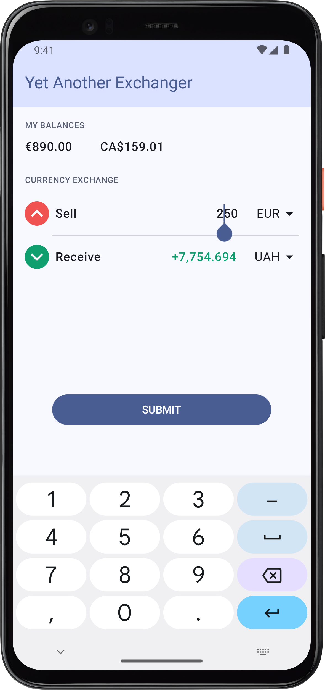

# Small sample app on modern android stack

## Stack
- Unidirectional Compose
- Coroutines and Flow
- Multi-module Hilt
- Room
- Retrofit
- Gradle convention plugins
- Testing
  - junit
  - mockito
  - robolectric
  - [turbine](https://github.com/cashapp/turbine)

## Structure
- `app` - UI and Android entry points
- `core/domain` - models, interfaces, business logic
- `core/db` - Room stuff
- `core/network` - Retrofit stuff
- `build-logic` - Gradle convention plugins

## Preview
